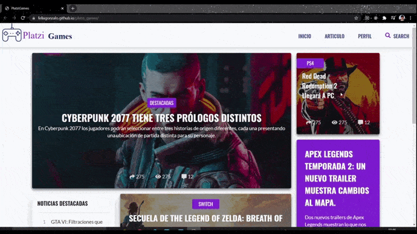

# Platzi Games
Proyecto de maquetación CSS

## Demo✨
[Mirar demo](https://felixgonzalo.github.io/platzi_games/)

## Acerca del proyecto 🧐
Proyecto de práctica del curso de preprocesadores CSS de Platzi



## Tecnologías 🛠

- HTML
- Pug
- CSS
- Sass
- JavaScript

## Instalar proyecto 👀
Clonar el proyecto
```
  git clone https://github.com/FelixGonzalo/platzi_games
```
Ejecutar el archivo index.html con su navegador web favorito

## Mis redes sociales 😄
* [Youtube](https://www.youtube.com/c/FelixCastro003).
* [Facebook](https://www.facebook.com/felixcastro003).
* [LinkedIn](https://www.linkedin.com/in/felix-castro-cubas-633037192/).
* [Twitter](https://twitter.com/felixcastro003).
* [Instagram](https://www.instagram.com/felixcastro003/).
